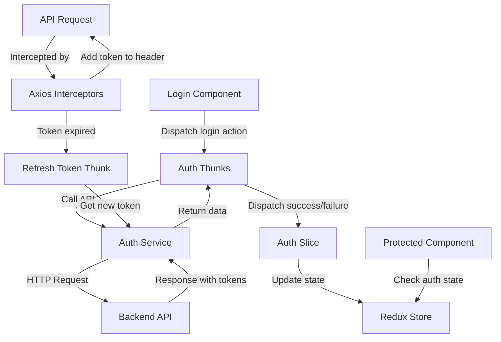

# Authentication System Architecture

## 1. Directory Structure

```
src/
├── api/
│   ├── config.js           # API configuration with base URL
│   └── axiosInstance.js    # Configured axios instance with interceptors
├── features/
│   └── auth/
│       ├── authSlice.js    # Redux slice for auth state
│       ├── authThunks.js   # Async thunks for auth operations
│       └── authSelectors.js # Selectors for auth state
├── services/
│   └── authService.js      # Service for auth API calls
├── store/
│   ├── index.js            # Redux store configuration
│   └── persistConfig.js    # Redux persist configuration
├── components/
│   └── PrivateRoute.jsx    # Updated route protection component
└── utils/
    └── tokenUtils.js       # Utilities for token management
```

## 2. Data Flow



## 3. Authentication State Structure

```javascript
{
  auth: {
    user: {
      id: null,
      email: null,
      name: null,
      // other user properties
    },
    tokens: {
      access: null,  // Only stored in memory (Redux state)
      // refresh token stored in localStorage via Redux Persist
    },
    status: {
      isAuthenticated: false,
      isLoading: false,
      error: null
    }
  }
}
```

## 4. Key Components and Their Responsibilities

### API Configuration (api/config.js)

- Provides configurable base URL for API endpoints
- Exports endpoint paths for authentication

### Axios Instance (api/axiosInstance.js)

- Configures axios with base URL and default headers
- Implements request interceptor to add authentication token
- Implements response interceptor to handle token expiration and refresh

### Auth Service (services/authService.js)

- Provides methods for API calls to authentication endpoints
- Handles login, logout, token refresh, and user data fetching

### Auth Slice (features/auth/authSlice.js)

- Defines the auth state structure
- Provides reducers for updating auth state
- Handles loading, success, and error states

### Auth Thunks (features/auth/authThunks.js)

- Implements async thunks for authentication operations
- Coordinates between UI, Redux store, and auth service

### Redux Store (store/index.js)

- Configures the Redux store with middleware
- Sets up Redux Persist for token storage

### PrivateRoute Component (components/PrivateRoute.jsx)

- Protects routes based on authentication status
- Redirects to login page if not authenticated

### Token Utilities (utils/tokenUtils.js)

- Provides utilities for token management
- Handles token expiration checking

## 5. Authentication Flow

### Login Flow

1. User enters credentials in Login component
2. Login component dispatches login thunk
3. Thunk calls auth service to make API request
4. On success, tokens and user data are stored in Redux
5. User is redirected to protected route

### API Request Flow

1. Component makes API request using axios instance
2. Request interceptor adds access token to Authorization header
3. If request fails with 401/403, response interceptor attempts token refresh
4. If refresh succeeds, original request is retried
5. If refresh fails, user is logged out and redirected to login

### Token Refresh Flow

1. Refresh mechanism checks token expiration before requests
2. If token is expired or about to expire, refresh thunk is dispatched
3. Refresh thunk uses refresh token to get new access token
4. Redux state is updated with new access token

### Logout Flow

1. User triggers logout action
2. Logout thunk is dispatched
3. Auth state is cleared from Redux
4. Refresh token is removed from localStorage
5. User is redirected to login page

## 6. Security Considerations

- Access token is only stored in memory (Redux state)
- Refresh token is stored in localStorage with proper expiration handling
- All API requests are intercepted to add authentication headers
- Token refresh happens automatically before token expiration
- Authentication errors are handled gracefully with proper redirects

## 7. Implementation Details

### Required Dependencies

- Redux Toolkit (`@reduxjs/toolkit`)
- React Redux (`react-redux`)
- Redux Persist (`redux-persist`)
- Axios (`axios`)

### Code Samples

#### Auth Slice (features/auth/authSlice.js)

```javascript
import { createSlice } from "@reduxjs/toolkit";
import { login, logout, refreshToken, fetchUserData } from "./authThunks";

const initialState = {
  user: null,
  tokens: {
    access: null,
  },
  status: {
    isAuthenticated: false,
    isLoading: false,
    error: null,
  },
};

const authSlice = createSlice({
  name: "auth",
  initialState,
  reducers: {
    clearError: (state) => {
      state.status.error = null;
    },
  },
  extraReducers: (builder) => {
    // Login
    builder.addCase(login.pending, (state) => {
      state.status.isLoading = true;
      state.status.error = null;
    });
    builder.addCase(login.fulfilled, (state, action) => {
      state.status.isLoading = false;
      state.user = action.payload.user;
      state.tokens.access = action.payload.tokens.access;
      state.status.isAuthenticated = true;
    });
    builder.addCase(login.rejected, (state, action) => {
      state.status.isLoading = false;
      state.status.error = action.payload || "Failed to login";
      state.status.isAuthenticated = false;
    });

    // Logout
    builder.addCase(logout.fulfilled, (state) => {
      return initialState;
    });

    // Token refresh
    builder.addCase(refreshToken.fulfilled, (state, action) => {
      state.tokens.access = action.payload.access;
    });
    builder.addCase(refreshToken.rejected, (state) => {
      return initialState;
    });

    // Fetch user data
    builder.addCase(fetchUserData.fulfilled, (state, action) => {
      state.user = action.payload;
    });
  },
});

export const { clearError } = authSlice.actions;
export default authSlice.reducer;
```

#### Auth Thunks (features/auth/authThunks.js)

```javascript
import { createAsyncThunk } from "@reduxjs/toolkit";
import authService from "../../services/authService";
import { persistor } from "../../store";

export const login = createAsyncThunk(
  "auth/login",
  async (credentials, { rejectWithValue }) => {
    try {
      const response = await authService.login(credentials);
      localStorage.setItem("refresh_token", response.tokens.refresh);
      return response;
    } catch (error) {
      return rejectWithValue(error.response?.data?.message || "Login failed");
    }
  }
);

export const logout = createAsyncThunk(
  "auth/logout",
  async (_, { rejectWithValue }) => {
    try {
      await authService.logout();
      localStorage.removeItem("refresh_token");
      persistor.purge();
      return null;
    } catch (error) {
      return rejectWithValue(error.response?.data?.message || "Logout failed");
    }
  }
);

export const refreshToken = createAsyncThunk(
  "auth/refreshToken",
  async (_, { rejectWithValue }) => {
    try {
      const refreshToken = localStorage.getItem("refresh_token");
      if (!refreshToken) {
        throw new Error("No refresh token available");
      }
      const response = await authService.refreshToken(refreshToken);
      return response;
    } catch (error) {
      localStorage.removeItem("refresh_token");
      return rejectWithValue(error.message || "Token refresh failed");
    }
  }
);

export const fetchUserData = createAsyncThunk(
  "auth/fetchUserData",
  async (_, { rejectWithValue, getState }) => {
    try {
      const { auth } = getState();
      if (!auth.tokens.access) {
        throw new Error("No access token available");
      }
      const response = await authService.getUserData();
      return response;
    } catch (error) {
      return rejectWithValue(
        error.response?.data?.message || "Failed to fetch user data"
      );
    }
  }
);
```

#### Auth Service (services/authService.js)

```javascript
import api from "../api/axiosInstance";
import { API_ENDPOINTS } from "../api/config";

const authService = {
  login: async (credentials) => {
    const response = await api.post(API_ENDPOINTS.LOGIN, credentials);
    return response.data;
  },

  logout: async () => {
    const response = await api.post(API_ENDPOINTS.LOGOUT);
    return response.data;
  },

  refreshToken: async (refreshToken) => {
    const response = await api.post(API_ENDPOINTS.REFRESH_TOKEN, {
      refresh: refreshToken,
    });
    return response.data;
  },

  getUserData: async () => {
    const response = await api.get(API_ENDPOINTS.USER);
    return response.data;
  },
};

export default authService;
```

#### API Config (api/config.js)

```javascript
export const API_BASE_URL =
  process.env.REACT_APP_API_BASE_URL || "http://localhost:8000";

export const API_ENDPOINTS = {
  LOGIN: "/auth/login/",
  LOGOUT: "/auth/logout/",
  REFRESH_TOKEN: "/auth/refresh/",
  USER: "/auth/user/",
};
```

#### Axios Instance (api/axiosInstance.js)

```javascript
import axios from "axios";
import { API_BASE_URL } from "./config";
import store from "../store";
import { refreshToken } from "../features/auth/authThunks";

const api = axios.create({
  baseURL: API_BASE_URL,
  headers: {
    "Content-Type": "application/json",
  },
});

// Request interceptor
api.interceptors.request.use(
  (config) => {
    const state = store.getState();
    const token = state.auth.tokens.access;

    if (token) {
      config.headers.Authorization = `Bearer ${token}`;
    }

    return config;
  },
  (error) => Promise.reject(error)
);

// Response interceptor
api.interceptors.response.use(
  (response) => response,
  async (error) => {
    const originalRequest = error.config;

    // If error is 401 and we haven't tried to refresh the token yet
    if (error.response.status === 401 && !originalRequest._retry) {
      originalRequest._retry = true;

      try {
        // Dispatch refresh token action
        await store.dispatch(refreshToken());

        // Get the new token
        const state = store.getState();
        const newToken = state.auth.tokens.access;

        // Update the original request with the new token
        originalRequest.headers.Authorization = `Bearer ${newToken}`;

        // Retry the original request
        return api(originalRequest);
      } catch (refreshError) {
        return Promise.reject(refreshError);
      }
    }

    return Promise.reject(error);
  }
);

export default api;
```

#### Redux Store (store/index.js)

```javascript
import { configureStore, combineReducers } from "@reduxjs/toolkit";
import { persistStore, persistReducer } from "redux-persist";
import storage from "redux-persist/lib/storage";
import authReducer from "../features/auth/authSlice";

// Only persist the refresh token, not the access token
const authPersistConfig = {
  key: "auth",
  storage,
  whitelist: [], // Don't persist anything from auth state
};

const rootReducer = combineReducers({
  auth: persistReducer(authPersistConfig, authReducer),
  // Add other reducers here
});

const store = configureStore({
  reducer: rootReducer,
  middleware: (getDefaultMiddleware) =>
    getDefaultMiddleware({
      serializableCheck: {
        // Ignore these action types
        ignoredActions: ["persist/PERSIST", "persist/REHYDRATE"],
      },
    }),
});

export const persistor = persistStore(store);
export default store;
```

#### PrivateRoute Component (components/PrivateRoute.jsx)

```jsx
import { Navigate, Outlet } from "react-router-dom";
import { useSelector } from "react-redux";
import { selectIsAuthenticated } from "../features/auth/authSelectors";

export default function PrivateRoute() {
  const isAuthenticated = useSelector(selectIsAuthenticated);

  return isAuthenticated ? <Outlet /> : <Navigate to="/login" replace />;
}
```

#### Auth Selectors (features/auth/authSelectors.js)

```javascript
export const selectUser = (state) => state.auth.user;
export const selectIsAuthenticated = (state) =>
  state.auth.status.isAuthenticated;
export const selectAuthLoading = (state) => state.auth.status.isLoading;
export const selectAuthError = (state) => state.auth.status.error;
export const selectAccessToken = (state) => state.auth.tokens.access;
```

#### Token Utilities (utils/tokenUtils.js)

```javascript
import jwtDecode from "jwt-decode";

export const isTokenExpired = (token) => {
  if (!token) return true;

  try {
    const decoded = jwtDecode(token);
    const currentTime = Date.now() / 1000;

    // Check if token is expired or about to expire (within 5 minutes)
    return decoded.exp < currentTime || decoded.exp - currentTime < 300;
  } catch (error) {
    return true;
  }
};

export const getTokenExpirationTime = (token) => {
  if (!token) return null;

  try {
    const decoded = jwtDecode(token);
    return decoded.exp;
  } catch (error) {
    return null;
  }
};
```

#### Login Component (pages/Login.jsx)

```jsx
import React, { useState, useEffect } from "react";
import { useDispatch, useSelector } from "react-redux";
import { useNavigate } from "react-router-dom";
import { login } from "../features/auth/authThunks";
import { clearError } from "../features/auth/authSlice";
import {
  selectAuthLoading,
  selectAuthError,
  selectIsAuthenticated,
} from "../features/auth/authSelectors";

export default function Login() {
  const [email, setEmail] = useState("");
  const [password, setPassword] = useState("");

  const dispatch = useDispatch();
  const navigate = useNavigate();

  const isLoading = useSelector(selectAuthLoading);
  const error = useSelector(selectAuthError);
  const isAuthenticated = useSelector(selectIsAuthenticated);

  useEffect(() => {
    // Clear any previous errors when component mounts
    dispatch(clearError());
  }, [dispatch]);

  useEffect(() => {
    // Redirect if already authenticated
    if (isAuthenticated) {
      navigate("/");
    }
  }, [isAuthenticated, navigate]);

  const handleSubmit = async (e) => {
    e.preventDefault();
    dispatch(login({ email, password }));
  };

  return (
    <form
      onSubmit={handleSubmit}
      className="max-w-sm mx-auto p-8 bg-white rounded shadow mt-20"
    >
      <h2 className="text-2xl font-bold mb-6 text-center">Connexion</h2>

      <label htmlFor="email" className="block mb-2 font-semibold">
        Email
      </label>
      <input
        id="email"
        type="email"
        value={email}
        onChange={(e) => setEmail(e.target.value)}
        className="w-full p-2 mb-4 border rounded"
        required
      />

      <label htmlFor="password" className="block mb-2 font-semibold">
        Mot de passe
      </label>
      <input
        id="password"
        type="password"
        value={password}
        onChange={(e) => setPassword(e.target.value)}
        className="w-full p-2 mb-4 border rounded"
        required
      />

      {error && <p className="mb-4 text-red-600">{error}</p>}

      <button
        type="submit"
        className="w-full bg-blue-600 text-white py-2 rounded hover:bg-blue-700 transition"
        disabled={isLoading}
      >
        {isLoading ? "Connexion en cours..." : "Se connecter"}
      </button>
    </form>
  );
}
```
